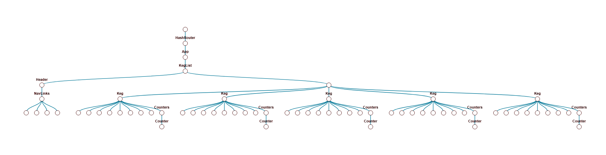
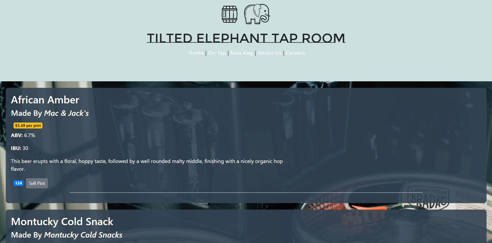

# Tilted Elephant Tap Room

## By **Chris Sanchez**

**Tilted Elephant Tap Room** is a website built for employees to manage keg inventory. Users can access the website regularly, with views of tap/keg lists, but no ability to perform authorized CRUD (Create, Read, Update, Delete) actions. The front-end was built was React, JavaScript, HTML5, and CSS3/SASS/SCSS. The website features Routing performed through the `react-router-dom` package. The site features dynamic CSS classes depending on price per pint and number of beers left in each keg.

 - -  -

### Setup/Installation Requirements

#### Zip:

1. Click [here](https://github.com/sanchito59/Tilted-Elephant-Tap-Room.git) to go to the repository location where you will find the clone/download menu.

 2. Navigate to the directory (folder) that contains your browser's downloads.
 3. Double-click on **Tilted Elephant Tap Room** directory (folder).
 4. Open directory contents by extracting/unzipping documents from folder.
 3. Make sure your system has `Node Package Manger (NPM)` installed.
 4. With `NPM` installed, run `npm install` .
 5. After the app files have been installed/configured, run `npm start` . This will launch **Tilted Elephant Tap Room** on `localhost:3000` in your default browser.

#### Clone:

 1. To clone the repository, from your terminal or command line enter: "git clone https://github.com/sanchito59/Tilted-Elephant-Tap-Room.git"
 2. Once the repository finishes downloading you will need to navigate to it in the terminal/command line.
 3. Make sure your system has `Node Package Manger (NPM)` installed.
 4. With `NPM` installed, run `npm install` .
 5. After the app files have been installed/configured, run `npm start` . This will launch **Tilted Elephant Tap Room** on `localhost:3000` in your default browser.

 - - -

<!-- ### Specifications: -->

<!-- |Behavior|Input|Output|
|---|---|---|
|(Read/GET)|User is on the homepage.|Homepage displays featured products and navigation to view all products.|
|(Create/POST) User adds a product to the catalogue of products.|'Vasiva HVAC Comp'|The corresponding pages now have the product added and so does the database. The user is shown a message to inform them of the successful creation.|
|(Read/GET)|User is on the product page.|Product page displays a list of all products. Included is the ability to create products.|
|(Update/PATCH) User changes the product.|'Fire System Alarms'|All pages reflect the changes and so does the database.|
|(Create/POST) User adds a review to the product.|Reviews contain information such as author, review text, and rating.|The product page now has the review added and so does the database. The user is shown a message to inform them of successfully changes.|
|(Update/PATCH) User changes the review's author.|'Michael Smith'|The product page now reflects the changes and so does the database. The user is shown a message to inform them of successful changes.|
|(Delete/DELETE) The user removes a review from a product.|Review for 'Fire System Alarms' is deleted.|The product page now reflects the changes and so does the database. The user is shown a message to inform them of successful changes.|
|(Delete/DELETE) The user deletes a product.|'Fire System Alarms'|The database and all corresponding pages no longer have the product.| -->

 <!-- - - - -->

### Technologies Used

 - React
 - JSX
 - JavaScript ES6
 - HTML5 / CSS3

 - - -

### Support and Contact

If you run into any issues running **Tilted Elephant Tap Room**, please contact **Chris Sanchez**.

### License

Permission is hereby granted, free of charge, to any person obtaining a copy of this software and associated documentation files (the "Software"), to deal in the Software without restriction, including without limitation the rights to use, copy, modify, merge, publish, distribute, sublicense, and/or sell copies of the Software, and to permit persons to whom the Software is furnished to do so, subject to the following conditions:

The above copyright notice and this permission notice shall be included in all copies or substantial portions of the Software.

THE SOFTWARE IS PROVIDED "AS IS", WITHOUT WARRANTY OF ANY KIND, EXPRESS OR IMPLIED, INCLUDING BUT NOT LIMITED TO THE WARRANTIES OF MERCHANTABILITY, FITNESS FOR A PARTICULAR PURPOSE AND NON-INFRINGEMENT. IN NO EVENT SHALL THE AUTHORS OR COPYRIGHT HOLDERS BE LIABLE FOR ANY CLAIM, DAMAGES OR OTHER LIABILITY, WHETHER IN AN ACTION OF CONTRACT, TORT OR OTHERWISE, ARISING FROM, OUT OF OR IN CONNECTION WITH THE SOFTWARE OR THE USE OR OTHER DEALINGS IN THE SOFTWARE.

Copyright (c) 2020 **Chris Sanchez**

